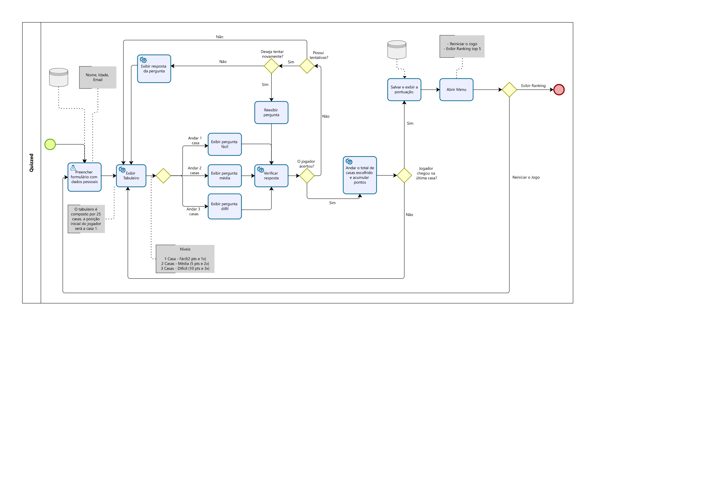

<p align="center">
    
</p>

<h3 align="center">
    Quizzed
</h3>

<p align="center">
    
    
    <a href="https://github.com/KassiaMabily/Quizzed/commits/main">
        
    </a>
    
</p>

<h4 align="center">
	🚧 Finished 🚧
</h4>

## 💻 Overview
O Quizzed é um jogo para um jogador apenas (singleplayer). Trata-se de uma mistura de gêneros Tabuleiro e Quiz (jogo de perguntas e respostas), aonde o jogador movimentará uma peça em um tabuleiro e então responderá a uma pergunta sobre a matéria de Gestão de Processos e Negócios.

---

<p align="center">
    
</p>

---

## ⚙️ How it works
<a href="https://expo.dev/@kassiafraga/quizzed" target="__blank">Projeto no Expo</a>

```bash

# Clone this repository
$ git clone https://github.com/KassiaMabily/Quizzed.git

# go to the project folder
$ cd quizzed

# install packages
$ expo install

# run local project
$ expo start

```

## 🚀 Tech Stack

-   **[Expo](https://expo.dev/)**

#### **Utilitários**

-   IDE:  **[Visual Studio](https://visualstudio.microsoft.com/pt-br/)**


---

## Authors
<table>
    <tr>
        <td align="center">
            <p>
                <a href="#">
                    
                    <br />
                    <sub><b>Guilherme Rudio</b></sub></a><a href="#" title="Guilhereme Rudio">
                </a>
                <br/>

[](https://www.linkedin.com/in/guilherme-rudio-790939164/) 
[](mailto:guilhermerudio@ucl.br)
            </p>
        </td>
    <td align="center">
        <p>
            <a href="#">
                
                <br />
                <sub><b>Kassia Fraga</b></sub></a><a href="#" title="Kassia Fraga">
            </a>
            <br/>

[](https://www.linkedin.com/in/kassia-fraga-178b7b1a7/) 
[](https://www.instagram.com/kassia.mabily/)
[](mailto:kassiafraga7@gmail.com)
        </p>
    </td>
    </tr>
    <tr>
    <td align="center">
        <p>
            <a href="#">
                
                <br />
                <sub><b>Loyslene Montanari</b></sub></a><a href="#" title="Loyslene Montanari">
            </a>
        <br />

[](https://www.linkedin.com/in/loyslene-montanari-55380511b/) 
[](https://www.instagram.com/loyslenem/)
[](mailto:loyslenealves@ucl.br)
            </p>
        </td>
        <td align="center">
            <p>
                <a href="#">
                    
                    <br />
                    <sub><b>Vanessa Machado</b></sub></a><a href="#" title="Vanessa Machado">
                </a>
                <br/>

[](https://www.linkedin.com/in/vanessa-machado-4302b8ab/) 
[](mailto:vanessasilva@ucl.br)
            </p>
        </td>
    </tr>
</table>

---

## 📝 Licença

Este projeto esta sob a licença [MIT](./LICENSE).